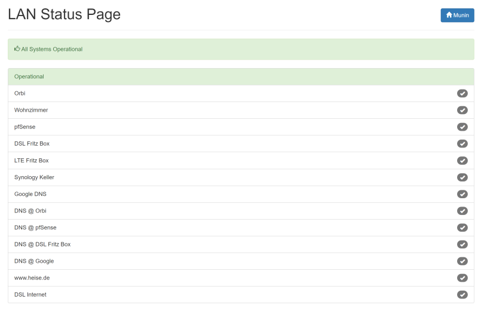

# status.sh

[](https://travis-ci.org/Cyclenerd/static_status)

Simple Bash script to generate a static status page. Displays status of websites, services (HTTP, SAP, MySQL...) and ping. Everything easy to customize. 🤓

You can also easily check more complicated things with this script.
For example if a text is present in a web page or if a host appears in the route path (traceroute).
Checking the route path is useful, for instance, if you have a backup mobile internet connection in addition to your cable connection.


## Installation

Download `status.sh` and configuration file:

	$ curl -f https://raw.githubusercontent.com/Cyclenerd/static_status/master/status.sh -o status.sh
	$ curl -f https://raw.githubusercontent.com/Cyclenerd/static_status/master/status_hostname_list.txt -o status_hostname_list.txt

Customize the `status.sh` script and the services to be monitored:

	$ vi status.sh
	$ vi status_hostname_list.txt

Run:

	$ bash status.sh

## Usage

	Usage: status.sh [OPTION]:
		OPTION is one of the following:
			silent	 no output from faulty connections to stout (default: no)
			loud	 output from successful and faulty connections to stout (default: no)
			help	 displays help (this message)

Example:

	$ bash status.sh loud

Execute a cron job every minute:

	$ crontab -e

Add:

	*/1 * * * * bash /path/to/status.sh silent >> /dev/null


## Demo

https://www.nkn-it.de/static_status_demo/

### Screenshots


## Custom Text

You can display a custom text instead of the HOSTNAME/IP/URL (see example below).



status_hostname_list.txt:
```csv
ping;192.168.100.1|Orbi
ping;192.168.100.102|Wohnzimmer
ping;192.168.221.1|pfSense
ping;192.168.211.1|DSL Fritz Box
ping;192.168.212.1|LTE Fritz Box
ping;192.168.211.80|Synology Keller
ping;8.8.8.8|Google DNS
nc;192.168.100.1|DNS @ Orbi;53
nc;192.168.221.1|DNS @ pfSense;53
nc;192.168.211.1|DNS @ DSL Fritz Box;53
nc;8.8.8.8|DNS @ Google;53
curl;http://www.heise.de/ping|www.heise.de
traceroute;192.168.211.1|DSL Internet;3
```

## Requirements

Only `bash`, `ping`, `traceroute`, `curl` and `nc`. In many *NIX distributions (Ubuntu, macOS) the commands are already included.
If not, the missing packages can be installed quickly.
On a debian-based system (Ubuntu), just run `sudo apt-get install curl iputils-ping traceroute netcat-openbsd`.

## TODO

* More and better documentation

Help is welcome 👍


## License

GNU Public License version 3.
Please feel free to fork and modify this on GitHub (https://github.com/Cyclenerd/static_shell).