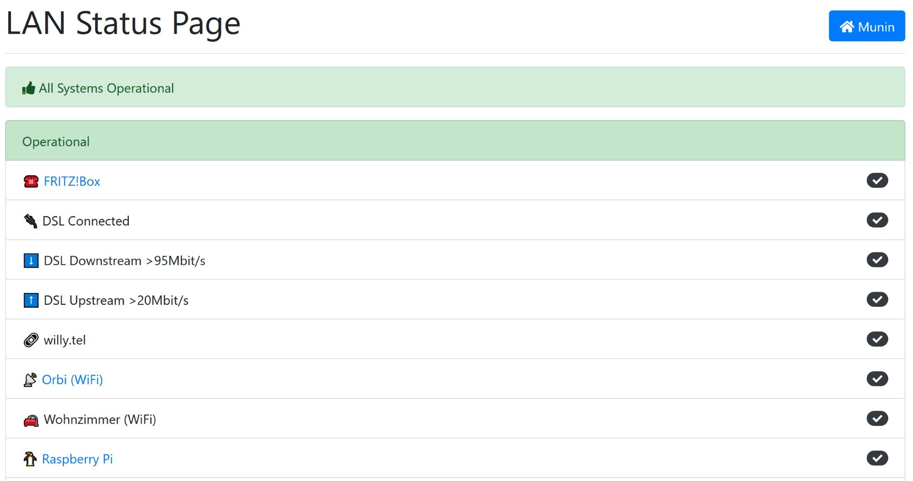
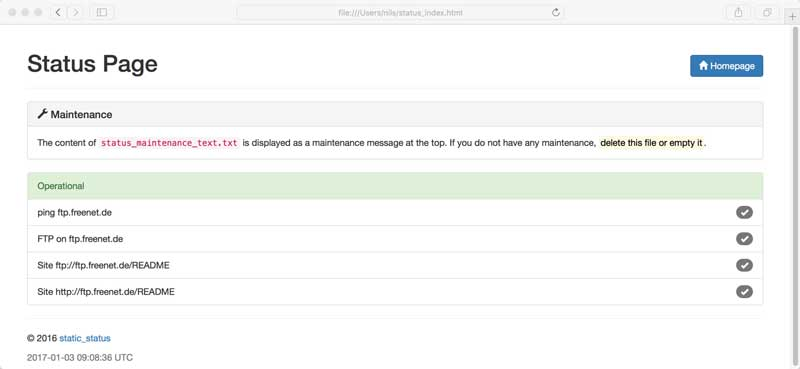
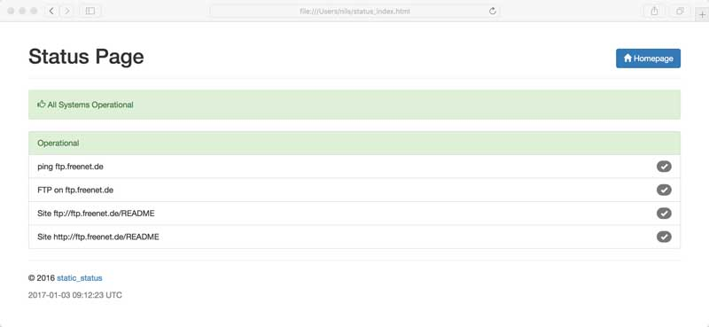
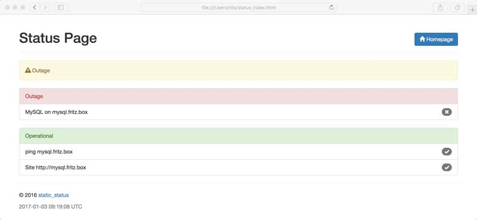
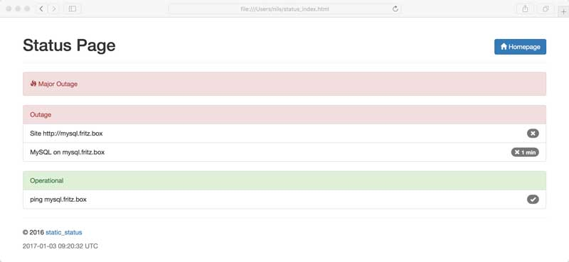

# status.sh

[](https://travis-ci.org/Cyclenerd/static_status)

Simple Bash script to generate a static status page. Displays status of websites, services (HTTP, SAP, MySQL...) and ping. Everything easy to customize. 🤓

You can also easily check more complicated things with this script.
For example if a text is present in a web page or if a host appears in the route path (traceroute).
Checking the route path is useful, for instance, if you have a backup mobile internet connection in addition to your cable connection.



In addition to the status web page, there is also a JSON version and an SVG icon.

## Installation

1️⃣ Download Bash script `status.sh`:

```shell
curl \
  -f "https://raw.githubusercontent.com/Cyclenerd/static_status/master/status.sh" \
  -o "status.sh"
```

> 💡 Tip: Update works exactly the same way as the installation. Simply download the latest version of `status.sh`.

2️⃣ Download configuration file `status_hostname_list.txt`:

```shell
curl \
  -f "https://raw.githubusercontent.com/Cyclenerd/static_status/master/status_hostname_list.txt" \
  -o "status_hostname_list.txt"
```

3️⃣ Customize the `status_hostname_list.txt` configuration file and define what you want to monitor:

```shell
vi status_hostname_list.txt
```

### Optional

Edit the script `status.sh` or better add more configuration to the configuration file `config`:

Download example configuration file:

```shell
curl \
  -f "https://raw.githubusercontent.com/Cyclenerd/static_status/master/config-example" \
  -o "config"
```

Customize configuration file:

```
vi config
```

### Run

```shell
bash status.sh
```

## Usage

```text
Usage: status.sh [OPTION]:
	OPTION is one of the following:
		silent  no output from faulty connections to stout (default: no)
		loud    output from successful and faulty connections to stout (default: no)
		help    displays help (this message)
```

Example:

```shell
bash status.sh loud
```

Execute a cron job every minute:

```shell
crontab -e
```

Add:

```
*/1 * * * * bash "/path/to/status.sh" silent >> /dev/null
```

## Demo

This [demo page](https://cyclenerd.github.io/static_status/) is generated with [GitHub Action](https://github.com/Cyclenerd/static_status/blob/master/.github/workflows/main.yml):
<https://cyclenerd.github.io/static_status/>

### Screenshots







## Custom Text

You can display a custom text instead of the HOSTNAME/IP/URL (see example below).


status_hostname_list.txt:

```csv
ping;8.8.8.8|Google DNS
nc;8.8.8.8|DNS @ Google;53
curl;http://www.heise.de/ping|www.heise.de
traceroute;192.168.211.1|DSL Internet;3
script;/bin/true|always up
```

## SVG Icon

If you want to signal directly if everything is fine or if something is wrong in the infrastructure, you can insert the SVG icon into your websites.

Please remember to include the image with a cache breaker URL (eg. an appended timestamp:
```
<a href="status.html">Status </a>
```

Static websites needs to fallback to render the icon with javascript, eg with:
```
document.write('')
```

## Requirements

Only `bash`, `ping`, `traceroute`, `curl`, `nc`, `grep` and `sed`.
In many *NIX distributions (Ubuntu, macOS) the commands are already included.
If not, the missing packages can be installed quickly.

On a debian-based system (Ubuntu), just run:

```shell
sudo apt install curl iputils-ping traceroute netcat-openbsd grep sed
```

> 💡 Tip: You can disable the `traceroute` dependency. Add `MY_TRACEROUTE_HOST=''` to your config.


## TODO

* More and better documentation

Help is welcome 👍


## License

GNU Public License version 3.
Please feel free to fork and modify this on GitHub (<https://github.com/Cyclenerd/static_shell>).